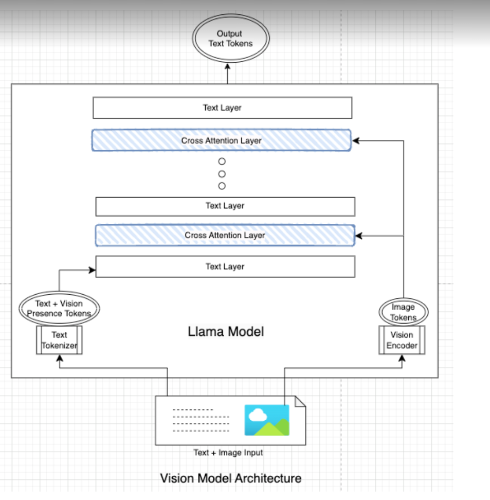

base model: `MllamaForConditionalGeneration`
pre-trained model: `meta-llama/Llama-3.2-11B-Vision-Instruct`

- input
```python
dict_keys(['input_ids', 'attention_mask', 'pixel_values', 'aspect_ratio_ids', 'aspect_ratio_mask', 'cross_attention_mask'])
```

- model architecture summary


```md
MllamaForConditionalGeneration
├── **Inputs**:
│   ├── `input_ids` (text token input)
│   ├── `attention_mask` (text attention mask)
│   ├── `pixel_values` (image input)
│   ├── `aspect_ratio_ids` (aspect ratio IDs for image)
│   ├── `aspect_ratio_mask` (aspect ratio mask for image)
│   └── `cross_attention_mask` (cross-attention mask)
│
├── Vision Model: MllamaVisionModel
│   ├── **Inputs**: `pixel_values`, `aspect_ratio_ids`, `aspect_ratio_mask`
│   ├── Patch Embedding
│   │   └── **Input**: image tensor → **Output**: patch features
│   ├── Gated Positional Embedding
│   │   └── **Input**: patch features → **Output**: position-enhanced features
│   ├── Pre/Post-Tile Positional Embedding
│   │   └── **Input**: `aspect_ratio_ids` → **Output**: tile-specific embeddings
│   ├── Vision Transformer
│   │   └── **Input**: embedded patches → **Output**: vision feature maps
│   ├── Global Transformer
│   │   └── **Input**: vision feature maps → **Output**: global features
│   └── **Outputs**: _vision features_ (for Cross-Attention)
│
├── Language Model: MllamaForCausalLM
│   ├── **Inputs**: `input_ids`, `attention_mask`, vision features (from Vision Model)
│   ├── Token Embedding Layer
│   │   └── **Input**: `input_ids`
│   │   └── **Output**: token embeddings
│   │
│   ├── Initial Transformer Layers (Self-Attention)
│   │   ├── **Input**: token embeddings, `attention_mask`
│   │   └── **Output**: intermediate language features
│   │
│   ├── Cross-Attention Decoder Layers
│   │   ├── **Inputs**:
│   │   │   ├── Intermediate language features (from Initial Transformer Layers)
│   │   │   ├── _vision features_ (from Vision Model)
│   │   │   ├── `cross_attention_mask`
│   │   ├── Cross-Attention Mechanism:
│   │   │   ├── **Input**: queries from language features, keys and values from vision features
│   │   │   └── **Output**: cross-modal attention-enhanced features
│   │   └── **Output**: cross-modal enriched language features
│   │
│   ├── Feedforward Layers (MLP)
│   │   ├── **Input**: cross-modal enriched language features
│   │   └── **Output**: deeper contextualized features
│   │
│   ├── Additional Transformer Layers (Post-Cross-Attention)
│   │   ├── **Input**: contextualized features
│   │   ├── Further self-attention and feedforward layers
│   │   └── **Output**: fully contextualized language features
│   │
│   ├── Output Layer Normalization
│   │   ├── Applies RMSNorm to the final contextualized features
│   │   └── **Output**: normalized features for generation
│   │
│   └── Final Logits Projection
│       ├── **Input**: normalized features
│       └── **Output**: logits for text generation
│
├── Multi-Modal Projector
│   └── **Input**: vision features → **Output**: projected vision features
│
└── **Outputs**: generated text logits
```

- model architecture
```python
MllamaForConditionalGeneration(
  (vision_model): MllamaVisionModel(
    (patch_embedding): Conv2d(3, 1280, kernel_size=(14, 14), stride=(14, 14), padding=valid, bias=False)
    (gated_positional_embedding): MllamaPrecomputedPositionEmbedding(
      (tile_embedding): Embedding(9, 8197120)
    )
    (pre_tile_positional_embedding): MllamaPrecomputedAspectRatioEmbedding(
      (embedding): Embedding(9, 5120)
    )
    (post_tile_positional_embedding): MllamaPrecomputedAspectRatioEmbedding(
      (embedding): Embedding(9, 5120)
    )
    (layernorm_pre): LayerNorm((1280,), eps=1e-05, elementwise_affine=True)
    (layernorm_post): LayerNorm((1280,), eps=1e-05, elementwise_affine=True)
    (transformer): MllamaVisionEncoder(
      (layers): ModuleList(
        (0-31): 32 x MllamaVisionEncoderLayer(
          (self_attn): MllamaVisionSdpaAttention(
            (q_proj): Linear4bit(in_features=1280, out_features=1280, bias=False)
            (k_proj): Linear4bit(in_features=1280, out_features=1280, bias=False)
            (v_proj): Linear4bit(in_features=1280, out_features=1280, bias=False)
            (o_proj): Linear4bit(in_features=1280, out_features=1280, bias=False)
          )
          (mlp): MllamaVisionMLP(
            (activation_fn): GELUActivation()
            (fc1): Linear4bit(in_features=1280, out_features=5120, bias=True)
            (fc2): Linear4bit(in_features=5120, out_features=1280, bias=True)
          )
          (input_layernorm): LayerNorm((1280,), eps=1e-05, elementwise_affine=True)
          (post_attention_layernorm): LayerNorm((1280,), eps=1e-05, elementwise_affine=True)
        )
      )
    )
    (global_transformer): MllamaVisionEncoder(
      (layers): ModuleList(
        (0-7): 8 x MllamaVisionEncoderLayer(
          (self_attn): MllamaVisionSdpaAttention(
            (q_proj): Linear4bit(in_features=1280, out_features=1280, bias=False)
            (k_proj): Linear4bit(in_features=1280, out_features=1280, bias=False)
            (v_proj): Linear4bit(in_features=1280, out_features=1280, bias=False)
            (o_proj): Linear4bit(in_features=1280, out_features=1280, bias=False)
          )
          (mlp): MllamaVisionMLP(
            (activation_fn): GELUActivation()
            (fc1): Linear4bit(in_features=1280, out_features=5120, bias=True)
            (fc2): Linear4bit(in_features=5120, out_features=1280, bias=True)
          )
          (input_layernorm): LayerNorm((1280,), eps=1e-05, elementwise_affine=True)
          (post_attention_layernorm): LayerNorm((1280,), eps=1e-05, elementwise_affine=True)
        )
      )
    )
  )
  (language_model): MllamaForCausalLM(
    (model): MllamaTextModel(
      (embed_tokens): Embedding(128264, 4096, padding_idx=128004)
      (layers): ModuleList(
        (0-2): 3 x MllamaSelfAttentionDecoderLayer(
          (self_attn): MllamaTextSelfSdpaAttention(
            (q_proj): Linear4bit(in_features=4096, out_features=4096, bias=False)
            (k_proj): Linear4bit(in_features=4096, out_features=1024, bias=False)
            (v_proj): Linear4bit(in_features=4096, out_features=1024, bias=False)
            (o_proj): Linear4bit(in_features=4096, out_features=4096, bias=False)
          )
          (mlp): MllamaTextMLP(
            (gate_proj): Linear4bit(in_features=4096, out_features=14336, bias=False)
            (up_proj): Linear4bit(in_features=4096, out_features=14336, bias=False)
            (down_proj): Linear4bit(in_features=14336, out_features=4096, bias=False)
            (act_fn): SiLU()
          )
          (input_layernorm): MllamaTextRMSNorm((4096,), eps=1e-05)
          (post_attention_layernorm): MllamaTextRMSNorm((4096,), eps=1e-05)
        )
        (3): MllamaCrossAttentionDecoderLayer(
          (cross_attn): MllamaTextCrossSdpaAttention(
            (q_proj): Linear4bit(in_features=4096, out_features=4096, bias=False)
            (k_proj): Linear4bit(in_features=4096, out_features=1024, bias=False)
            (v_proj): Linear4bit(in_features=4096, out_features=1024, bias=False)
            (o_proj): Linear4bit(in_features=4096, out_features=4096, bias=False)
            (q_norm): MllamaTextRMSNorm((128,), eps=1e-05)
            (k_norm): MllamaTextRMSNorm((128,), eps=1e-05)
          )
          (input_layernorm): MllamaTextRMSNorm((4096,), eps=1e-05)
          (mlp): MllamaTextMLP(
            (gate_proj): Linear4bit(in_features=4096, out_features=14336, bias=False)
            (up_proj): Linear4bit(in_features=4096, out_features=14336, bias=False)
            (down_proj): Linear4bit(in_features=14336, out_features=4096, bias=False)
            (act_fn): SiLU()
          )
          (post_attention_layernorm): MllamaTextRMSNorm((4096,), eps=1e-05)
        )
        (4-7): 4 x MllamaSelfAttentionDecoderLayer(
          (self_attn): MllamaTextSelfSdpaAttention(
            (q_proj): Linear4bit(in_features=4096, out_features=4096, bias=False)
            (k_proj): Linear4bit(in_features=4096, out_features=1024, bias=False)
            (v_proj): Linear4bit(in_features=4096, out_features=1024, bias=False)
            (o_proj): Linear4bit(in_features=4096, out_features=4096, bias=False)
          )
          (mlp): MllamaTextMLP(
            (gate_proj): Linear4bit(in_features=4096, out_features=14336, bias=False)
            (up_proj): Linear4bit(in_features=4096, out_features=14336, bias=False)
            (down_proj): Linear4bit(in_features=14336, out_features=4096, bias=False)
            (act_fn): SiLU()
          )
          (input_layernorm): MllamaTextRMSNorm((4096,), eps=1e-05)
          (post_attention_layernorm): MllamaTextRMSNorm((4096,), eps=1e-05)
        )
        (8): MllamaCrossAttentionDecoderLayer(
          (cross_attn): MllamaTextCrossSdpaAttention(
            (q_proj): Linear4bit(in_features=4096, out_features=4096, bias=False)
            (k_proj): Linear4bit(in_features=4096, out_features=1024, bias=False)
            (v_proj): Linear4bit(in_features=4096, out_features=1024, bias=False)
            (o_proj): Linear4bit(in_features=4096, out_features=4096, bias=False)
            (q_norm): MllamaTextRMSNorm((128,), eps=1e-05)
            (k_norm): MllamaTextRMSNorm((128,), eps=1e-05)
          )
          (input_layernorm): MllamaTextRMSNorm((4096,), eps=1e-05)
          (mlp): MllamaTextMLP(
            (gate_proj): Linear4bit(in_features=4096, out_features=14336, bias=False)
            (up_proj): Linear4bit(in_features=4096, out_features=14336, bias=False)
            (down_proj): Linear4bit(in_features=14336, out_features=4096, bias=False)
            (act_fn): SiLU()
          )
          (post_attention_layernorm): MllamaTextRMSNorm((4096,), eps=1e-05)
        )
        (9-12): 4 x MllamaSelfAttentionDecoderLayer(
          (self_attn): MllamaTextSelfSdpaAttention(
            (q_proj): Linear4bit(in_features=4096, out_features=4096, bias=False)
            (k_proj): Linear4bit(in_features=4096, out_features=1024, bias=False)
            (v_proj): Linear4bit(in_features=4096, out_features=1024, bias=False)
            (o_proj): Linear4bit(in_features=4096, out_features=4096, bias=False)
          )
          (mlp): MllamaTextMLP(
            (gate_proj): Linear4bit(in_features=4096, out_features=14336, bias=False)
            (up_proj): Linear4bit(in_features=4096, out_features=14336, bias=False)
            (down_proj): Linear4bit(in_features=14336, out_features=4096, bias=False)
            (act_fn): SiLU()
          )
          (input_layernorm): MllamaTextRMSNorm((4096,), eps=1e-05)
          (post_attention_layernorm): MllamaTextRMSNorm((4096,), eps=1e-05)
        )
        (13): MllamaCrossAttentionDecoderLayer(
          (cross_attn): MllamaTextCrossSdpaAttention(
            (q_proj): Linear4bit(in_features=4096, out_features=4096, bias=False)
            (k_proj): Linear4bit(in_features=4096, out_features=1024, bias=False)
            (v_proj): Linear4bit(in_features=4096, out_features=1024, bias=False)
            (o_proj): Linear4bit(in_features=4096, out_features=4096, bias=False)
            (q_norm): MllamaTextRMSNorm((128,), eps=1e-05)
            (k_norm): MllamaTextRMSNorm((128,), eps=1e-05)
          )
          (input_layernorm): MllamaTextRMSNorm((4096,), eps=1e-05)
          (mlp): MllamaTextMLP(
            (gate_proj): Linear4bit(in_features=4096, out_features=14336, bias=False)
            (up_proj): Linear4bit(in_features=4096, out_features=14336, bias=False)
            (down_proj): Linear4bit(in_features=14336, out_features=4096, bias=False)
            (act_fn): SiLU()
          )
          (post_attention_layernorm): MllamaTextRMSNorm((4096,), eps=1e-05)
        )
        (14-17): 4 x MllamaSelfAttentionDecoderLayer(
          (self_attn): MllamaTextSelfSdpaAttention(
            (q_proj): Linear4bit(in_features=4096, out_features=4096, bias=False)
            (k_proj): Linear4bit(in_features=4096, out_features=1024, bias=False)
            (v_proj): Linear4bit(in_features=4096, out_features=1024, bias=False)
            (o_proj): Linear4bit(in_features=4096, out_features=4096, bias=False)
          )
          (mlp): MllamaTextMLP(
            (gate_proj): Linear4bit(in_features=4096, out_features=14336, bias=False)
            (up_proj): Linear4bit(in_features=4096, out_features=14336, bias=False)
            (down_proj): Linear4bit(in_features=14336, out_features=4096, bias=False)
            (act_fn): SiLU()
          )
          (input_layernorm): MllamaTextRMSNorm((4096,), eps=1e-05)
          (post_attention_layernorm): MllamaTextRMSNorm((4096,), eps=1e-05)
        )
        (18): MllamaCrossAttentionDecoderLayer(
          (cross_attn): MllamaTextCrossSdpaAttention(
            (q_proj): Linear4bit(in_features=4096, out_features=4096, bias=False)
            (k_proj): Linear4bit(in_features=4096, out_features=1024, bias=False)
            (v_proj): Linear4bit(in_features=4096, out_features=1024, bias=False)
            (o_proj): Linear4bit(in_features=4096, out_features=4096, bias=False)
            (q_norm): MllamaTextRMSNorm((128,), eps=1e-05)
            (k_norm): MllamaTextRMSNorm((128,), eps=1e-05)
          )
          (input_layernorm): MllamaTextRMSNorm((4096,), eps=1e-05)
          (mlp): MllamaTextMLP(
            (gate_proj): Linear4bit(in_features=4096, out_features=14336, bias=False)
            (up_proj): Linear4bit(in_features=4096, out_features=14336, bias=False)
            (down_proj): Linear4bit(in_features=14336, out_features=4096, bias=False)
            (act_fn): SiLU()
          )
          (post_attention_layernorm): MllamaTextRMSNorm((4096,), eps=1e-05)
        )
        (19-22): 4 x MllamaSelfAttentionDecoderLayer(
          (self_attn): MllamaTextSelfSdpaAttention(
            (q_proj): Linear4bit(in_features=4096, out_features=4096, bias=False)
            (k_proj): Linear4bit(in_features=4096, out_features=1024, bias=False)
            (v_proj): Linear4bit(in_features=4096, out_features=1024, bias=False)
            (o_proj): Linear4bit(in_features=4096, out_features=4096, bias=False)
          )
          (mlp): MllamaTextMLP(
            (gate_proj): Linear4bit(in_features=4096, out_features=14336, bias=False)
            (up_proj): Linear4bit(in_features=4096, out_features=14336, bias=False)
            (down_proj): Linear4bit(in_features=14336, out_features=4096, bias=False)
            (act_fn): SiLU()
          )
          (input_layernorm): MllamaTextRMSNorm((4096,), eps=1e-05)
          (post_attention_layernorm): MllamaTextRMSNorm((4096,), eps=1e-05)
        )
        (23): MllamaCrossAttentionDecoderLayer(
          (cross_attn): MllamaTextCrossSdpaAttention(
            (q_proj): Linear4bit(in_features=4096, out_features=4096, bias=False)
            (k_proj): Linear4bit(in_features=4096, out_features=1024, bias=False)
            (v_proj): Linear4bit(in_features=4096, out_features=1024, bias=False)
            (o_proj): Linear4bit(in_features=4096, out_features=4096, bias=False)
            (q_norm): MllamaTextRMSNorm((128,), eps=1e-05)
            (k_norm): MllamaTextRMSNorm((128,), eps=1e-05)
          )
          (input_layernorm): MllamaTextRMSNorm((4096,), eps=1e-05)
          (mlp): MllamaTextMLP(
            (gate_proj): Linear4bit(in_features=4096, out_features=14336, bias=False)
            (up_proj): Linear4bit(in_features=4096, out_features=14336, bias=False)
            (down_proj): Linear4bit(in_features=14336, out_features=4096, bias=False)
            (act_fn): SiLU()
          )
          (post_attention_layernorm): MllamaTextRMSNorm((4096,), eps=1e-05)
        )
        (24-27): 4 x MllamaSelfAttentionDecoderLayer(
          (self_attn): MllamaTextSelfSdpaAttention(
            (q_proj): Linear4bit(in_features=4096, out_features=4096, bias=False)
            (k_proj): Linear4bit(in_features=4096, out_features=1024, bias=False)
            (v_proj): Linear4bit(in_features=4096, out_features=1024, bias=False)
            (o_proj): Linear4bit(in_features=4096, out_features=4096, bias=False)
          )
          (mlp): MllamaTextMLP(
            (gate_proj): Linear4bit(in_features=4096, out_features=14336, bias=False)
            (up_proj): Linear4bit(in_features=4096, out_features=14336, bias=False)
            (down_proj): Linear4bit(in_features=14336, out_features=4096, bias=False)
            (act_fn): SiLU()
          )
          (input_layernorm): MllamaTextRMSNorm((4096,), eps=1e-05)
          (post_attention_layernorm): MllamaTextRMSNorm((4096,), eps=1e-05)
        )
        (28): MllamaCrossAttentionDecoderLayer(
          (cross_attn): MllamaTextCrossSdpaAttention(
            (q_proj): Linear4bit(in_features=4096, out_features=4096, bias=False)
            (k_proj): Linear4bit(in_features=4096, out_features=1024, bias=False)
            (v_proj): Linear4bit(in_features=4096, out_features=1024, bias=False)
            (o_proj): Linear4bit(in_features=4096, out_features=4096, bias=False)
            (q_norm): MllamaTextRMSNorm((128,), eps=1e-05)
            (k_norm): MllamaTextRMSNorm((128,), eps=1e-05)
          )
          (input_layernorm): MllamaTextRMSNorm((4096,), eps=1e-05)
          (mlp): MllamaTextMLP(
            (gate_proj): Linear4bit(in_features=4096, out_features=14336, bias=False)
            (up_proj): Linear4bit(in_features=4096, out_features=14336, bias=False)
            (down_proj): Linear4bit(in_features=14336, out_features=4096, bias=False)
            (act_fn): SiLU()
          )
          (post_attention_layernorm): MllamaTextRMSNorm((4096,), eps=1e-05)
        )
        (29-32): 4 x MllamaSelfAttentionDecoderLayer(
          (self_attn): MllamaTextSelfSdpaAttention(
            (q_proj): Linear4bit(in_features=4096, out_features=4096, bias=False)
            (k_proj): Linear4bit(in_features=4096, out_features=1024, bias=False)
            (v_proj): Linear4bit(in_features=4096, out_features=1024, bias=False)
            (o_proj): Linear4bit(in_features=4096, out_features=4096, bias=False)
          )
          (mlp): MllamaTextMLP(
            (gate_proj): Linear4bit(in_features=4096, out_features=14336, bias=False)
            (up_proj): Linear4bit(in_features=4096, out_features=14336, bias=False)
            (down_proj): Linear4bit(in_features=14336, out_features=4096, bias=False)
            (act_fn): SiLU()
          )
          (input_layernorm): MllamaTextRMSNorm((4096,), eps=1e-05)
          (post_attention_layernorm): MllamaTextRMSNorm((4096,), eps=1e-05)
        )
        (33): MllamaCrossAttentionDecoderLayer(
          (cross_attn): MllamaTextCrossSdpaAttention(
            (q_proj): Linear4bit(in_features=4096, out_features=4096, bias=False)
            (k_proj): Linear4bit(in_features=4096, out_features=1024, bias=False)
            (v_proj): Linear4bit(in_features=4096, out_features=1024, bias=False)
            (o_proj): Linear4bit(in_features=4096, out_features=4096, bias=False)
            (q_norm): MllamaTextRMSNorm((128,), eps=1e-05)
            (k_norm): MllamaTextRMSNorm((128,), eps=1e-05)
          )
          (input_layernorm): MllamaTextRMSNorm((4096,), eps=1e-05)
          (mlp): MllamaTextMLP(
            (gate_proj): Linear4bit(in_features=4096, out_features=14336, bias=False)
            (up_proj): Linear4bit(in_features=4096, out_features=14336, bias=False)
            (down_proj): Linear4bit(in_features=14336, out_features=4096, bias=False)
            (act_fn): SiLU()
          )
          (post_attention_layernorm): MllamaTextRMSNorm((4096,), eps=1e-05)
        )
        (34-37): 4 x MllamaSelfAttentionDecoderLayer(
          (self_attn): MllamaTextSelfSdpaAttention(
            (q_proj): Linear4bit(in_features=4096, out_features=4096, bias=False)
            (k_proj): Linear4bit(in_features=4096, out_features=1024, bias=False)
            (v_proj): Linear4bit(in_features=4096, out_features=1024, bias=False)
            (o_proj): Linear4bit(in_features=4096, out_features=4096, bias=False)
          )
          (mlp): MllamaTextMLP(
            (gate_proj): Linear4bit(in_features=4096, out_features=14336, bias=False)
            (up_proj): Linear4bit(in_features=4096, out_features=14336, bias=False)
            (down_proj): Linear4bit(in_features=14336, out_features=4096, bias=False)
            (act_fn): SiLU()
          )
          (input_layernorm): MllamaTextRMSNorm((4096,), eps=1e-05)
          (post_attention_layernorm): MllamaTextRMSNorm((4096,), eps=1e-05)
        )
        (38): MllamaCrossAttentionDecoderLayer(
          (cross_attn): MllamaTextCrossSdpaAttention(
            (q_proj): Linear4bit(in_features=4096, out_features=4096, bias=False)
            (k_proj): Linear4bit(in_features=4096, out_features=1024, bias=False)
            (v_proj): Linear4bit(in_features=4096, out_features=1024, bias=False)
            (o_proj): Linear4bit(in_features=4096, out_features=4096, bias=False)
            (q_norm): MllamaTextRMSNorm((128,), eps=1e-05)
            (k_norm): MllamaTextRMSNorm((128,), eps=1e-05)
          )
          (input_layernorm): MllamaTextRMSNorm((4096,), eps=1e-05)
          (mlp): MllamaTextMLP(
            (gate_proj): Linear4bit(in_features=4096, out_features=14336, bias=False)
            (up_proj): Linear4bit(in_features=4096, out_features=14336, bias=False)
            (down_proj): Linear4bit(in_features=14336, out_features=4096, bias=False)
            (act_fn): SiLU()
          )
          (post_attention_layernorm): MllamaTextRMSNorm((4096,), eps=1e-05)
        )
        (39): MllamaSelfAttentionDecoderLayer(
          (self_attn): MllamaTextSelfSdpaAttention(
            (q_proj): Linear4bit(in_features=4096, out_features=4096, bias=False)
            (k_proj): Linear4bit(in_features=4096, out_features=1024, bias=False)
            (v_proj): Linear4bit(in_features=4096, out_features=1024, bias=False)
            (o_proj): Linear4bit(in_features=4096, out_features=4096, bias=False)
          )
          (mlp): MllamaTextMLP(
            (gate_proj): Linear4bit(in_features=4096, out_features=14336, bias=False)
            (up_proj): Linear4bit(in_features=4096, out_features=14336, bias=False)
            (down_proj): Linear4bit(in_features=14336, out_features=4096, bias=False)
            (act_fn): SiLU()
          )
          (input_layernorm): MllamaTextRMSNorm((4096,), eps=1e-05)
          (post_attention_layernorm): MllamaTextRMSNorm((4096,), eps=1e-05)
        )
      )
      (norm): MllamaTextRMSNorm((4096,), eps=1e-05)
      (rotary_emb): MllamaRotaryEmbedding()
    )
    (lm_head): Linear(in_features=4096, out_features=128256, bias=False)
  )
  (multi_modal_projector): Linear4bit(in_features=7680, out_features=4096, bias=True)
)
```
